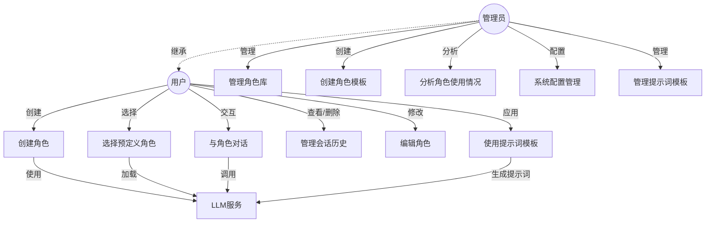
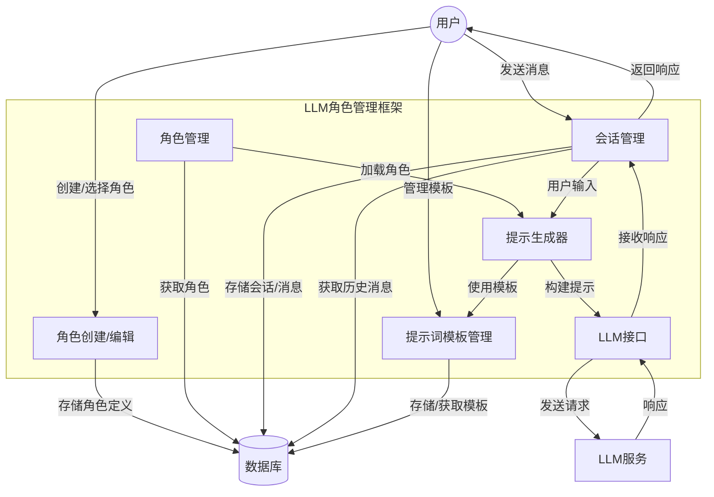
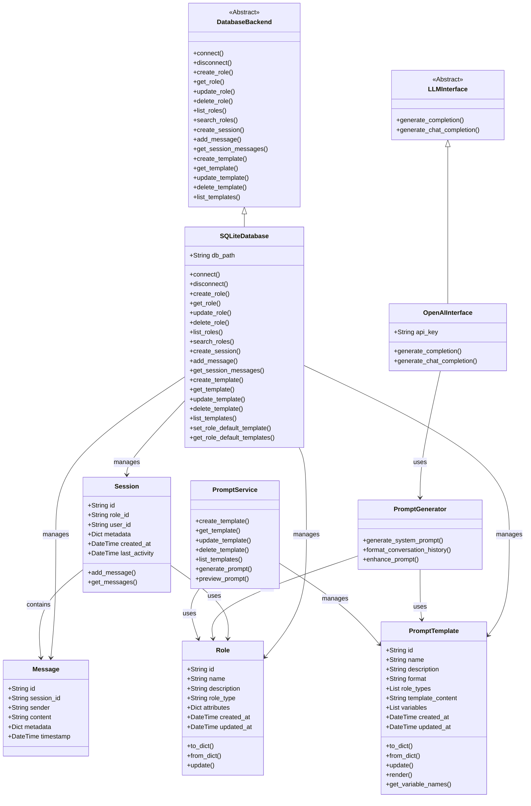

# 设计文档

## 1. 系统概述

LLM 角色管理框架是一个用于创建和管理大型语言模型预定义角色的系统。它允许用户定义角色的行为模式、知识范围和交互风格，从而使LLM能够在特定场景中表现出一致的特性。该框架采用模块化设计，基于SQLite提供数据持久化，并支持多种角色属性的自定义。

## 2. 系统用例图



## 3. 系统数据流图



## 4. 系统类图



## 5. 技术架构

### 5.1 角色管理系统

角色管理系统负责角色的定义、存储和检索。它建立在以下核心组件上：

#### 5.1.1 角色模型

- **基本信息**：
  - 名称
  - 描述
  - 角色类型
  
- **行为特征**：
  - 语言风格（如专业、友好、技术性等）
  - 知识领域
  - 响应模式（详细、简洁等）
  
- **约束条件**：
  - 允许讨论的主题
  - 禁止的主题或行为
  - 角色边界

#### 5.1.2 角色管理 API

角色管理 API 基于服务层和 API 层的分离设计，实现了角色的完整生命周期管理。

**目录结构**:
```
src/llm_roles/
  ├── api/
  │   ├── __init__.py
  │   ├── role_api.py      # 角色管理API层
  │   └── prompt_api.py    # 提示词模板API层
  └── services/
      ├── __init__.py
      ├── role_manager.py  # 角色管理服务层
      └── prompt_service.py # 提示词服务层
```

**服务层 (RoleManager)**:

服务层提供核心业务逻辑，负责角色对象的处理和与数据库的交互：

- `create_role()`: 创建新角色并持久化
- `get_role()`: 根据ID检索角色
- `update_role()`: 更新现有角色
- `delete_role()`: 删除角色
- `list_roles()`: 获取角色列表
- `search_roles()`: 搜索角色

**API层 (RoleAPI)**:

API层负责请求验证、错误处理和响应格式化：

- `create_role()`: 验证请求数据并调用服务层创建角色
- `get_role()`: 获取单个角色
- `update_role()`: 验证更新数据并调用服务层更新角色
- `delete_role()`: 删除指定角色
- `list_roles()`: 获取角色列表，支持分页
- `search_roles()`: 根据关键词搜索角色

**响应格式**:

API响应采用统一格式，包含状态码、消息、成功标志和数据：

```json
{
  "status": 200,
  "message": "操作消息",
  "success": true,
  "data": {
    // 返回的数据
  }
}
```

### 5.2 提示词模板系统

提示词模板系统负责管理和应用可复用的提示词模板。它使角色定义和指令提示分离，增强系统的灵活性与可扩展性。

#### 5.2.1 提示词模板模型

- **基本信息**：
  - ID
  - 名称
  - 描述
  - 格式（如OpenAI、Claude等）
  
- **内容结构**：
  - 模板内容（支持变量占位符）
  - 变量定义列表
  - 适用的角色类型
  
- **变量定义**：
  - 名称
  - 描述
  - 数据源（如从角色属性映射）

#### 5.2.2 提示词模板 API

**服务层 (PromptService)**:

- `create_template()`: 创建新的提示词模板
- `get_template()`: 获取特定模板
- `update_template()`: 更新已有模板
- `delete_template()`: 删除模板
- `list_templates()`: 列出所有模板
- `generate_prompt()`: 根据角色和模板生成提示词
- `preview_prompt()`: 预览角色在特定模板下的提示词

**API层 (PromptAPI)**:

- `create_template()`: 创建提示词模板
- `get_template()`: 获取模板详情
- `update_template()`: 更新模板
- `delete_template()`: 删除模板
- `list_templates()`: 获取模板列表，支持分页
- `generate_prompt()`: 根据角色和模板生成提示词
- `preview_prompt()`: 预览生成的提示词

### 5.3 数据库设计更新

数据库架构已更新，包含以下主要更新：

#### 5.3.1 新增表结构

**prompt_templates 表**:
```sql
CREATE TABLE prompt_templates (
    id TEXT PRIMARY KEY,
    name TEXT NOT NULL,
    description TEXT,
    format TEXT,
    is_default BOOLEAN DEFAULT 0,
    role_types TEXT,
    template_content TEXT NOT NULL,
    variables JSON,
    created_at TIMESTAMP NOT NULL DEFAULT CURRENT_TIMESTAMP,
    updated_at TIMESTAMP NOT NULL DEFAULT CURRENT_TIMESTAMP
);
```

**role_default_templates 表**:
```sql
CREATE TABLE role_default_templates (
    role_id TEXT NOT NULL,
    template_id TEXT NOT NULL,
    created_at TIMESTAMP NOT NULL DEFAULT CURRENT_TIMESTAMP,
    PRIMARY KEY (role_id, template_id),
    FOREIGN KEY (role_id) REFERENCES roles(id),
    FOREIGN KEY (template_id) REFERENCES prompt_templates(id)
);
```

#### 5.3.2 数据处理改进

- 增强了JSON处理的健壮性：
  - 添加了`safe_json_loads()`方法安全地解析JSON，避免解析错误导致系统崩溃
  - 支持多种格式的字段存储（如JSON和逗号分隔的字符串）

- 优化了角色类型字段处理：
  - 支持通过逗号分隔的字符串列表存储
  - 自动转换为程序中更易于使用的数组形式

## 6. 功能更新

### 6.1 提示词模板渲染

提示词模板系统现支持高级模板渲染功能：

- **变量替换**：
  - 支持多种格式的占位符：`{{{variable}}}`、`{{variable}}`和`{variable}`
  - 自动从角色属性中提取变量值
  - 支持自定义变量覆盖

- **列表迭代**：
  - 支持Mustache风格的列表渲染：`{{#list_var}}...{{/list_var}}`
  - 可在列表项中使用`{{.}}`或`{{{.}}}`引用当前项

- **条件渲染**：
  - 根据变量值存在与否有条件地渲染内容

### 6.2 默认模板管理

系统提供了一系列默认模板，满足不同场景需求：

- **标准角色模板**：包含角色的基本信息和行为特征
- **简洁角色模板**：只包含最基本的角色定义
- **详细角色模板**：包含所有角色信息和详细约束
- **编程助手模板**：针对编程相关角色优化
- **创意写作模板**：针对创意写作相关角色优化

### 6.3 角色-模板关联

- 支持为角色设置默认模板
- 维护角色与多个模板的关联关系
- 基于角色类型自动选择合适的模板

## 7. 系统优化

### 7.1 错误处理增强

- 针对JSON解析错误增加了健壮性处理：
  - 添加了`safe_json_loads()`函数安全地解析可能的无效JSON
  - 对于格式不一致的数据（如字符串与JSON混用）提供了平滑处理

- API错误响应更加详细：
  - 提供更具体的错误消息
  - 统一的错误响应格式，便于前端解析

### 7.2 性能优化

- 数据库查询优化：
  - 减少重复连接数据库的操作
  - 添加异常处理和资源释放

- 模板渲染性能优化：
  - 缓存默认模板减少数据库查询
  - 优化正则表达式匹配提高渲染速度

## 8. 用例更新

### 8.1 创建和使用提示词模板

**用例描述**：用户创建自定义提示词模板并应用于角色。

**流程**：
1. 用户定义模板名称、描述和适用角色类型
2. 用户编写模板内容，包含变量占位符
3. 用户定义变量及其数据源
4. 系统保存模板
5. 用户将模板应用于特定角色
6. 系统根据角色属性渲染模板
7. 生成的提示词用于与LLM交互

**示例API调用**：
```python
# 创建模板
template_data = {
    "name": "专业顾问模板",
    "description": "适用于各类专业顾问角色",
    "format": "openai",
    "role_types": ["advisor", "consultant", "expert"],
    "template_content": "你是{{name}}，一名专业的{{role_type}}。\n\n{{description}}\n\n使用{{language_style}}的表达方式。",
    "variables": [
        {"name": "name", "source": "name"},
        {"name": "role_type", "source": "role_type"},
        {"name": "description", "source": "description"},
        {"name": "language_style", "source": "language_style"}
    ]
}
response = client.post("/prompt-templates", json=template_data)
template_id = response.json()["data"]["id"]

# 预览模板渲染结果
preview = client.get(f"/roles/{role_id}/preview-prompt/{template_id}")
```

### 8.2 管理角色的默认模板

**用例描述**：管理员为不同类型的角色设置默认提示词模板。

**流程**：
1. 管理员查看可用的提示词模板
2. 管理员选择特定角色
3. 管理员为角色分配一个或多个默认模板
4. 系统保存角色-模板关联
5. 用户选择角色时，系统自动使用默认模板

**示例API调用**：
```python
# 设置角色的默认模板
response = client.post(f"/roles/{role_id}/default-templates/{template_id}")

# 获取角色的所有默认模板
templates = client.get(f"/roles/{role_id}/default-templates")
```

### 8.3 基于模板生成角色提示词

**用例描述**：系统使用模板为角色生成适合的提示词。

**流程**：
1. 用户选择角色
2. 系统查找角色的默认模板或用户指定的模板
3. 系统从角色属性中提取变量值
4. 系统渲染模板生成完整提示词
5. 提示词发送给LLM进行交互

**示例API调用**：
```python
# 使用特定模板生成提示词
response = client.post("/generate-prompt", json={
    "role_id": "role-123",
    "template_id": "template-456",
    "format": "openai",
    "custom_vars": {
        "extra_instruction": "注重专业性和准确性"
    }
})
prompt = response.json()["data"]["prompt"]
```

## 9. 未来规划

### 9.1 提示词模板扩展

- **版本控制**：为模板添加版本控制功能
- **模板分类**：支持模板分类和标签
- **模板评分**：引入模板效果评分机制
- **模板市场**：建立模板共享和复用平台

### 9.2 高级渲染功能

- **条件语句**：支持if-else条件逻辑
- **循环嵌套**：支持多层嵌套的循环结构
- **部分模板**：支持模板片段的复用和组合
- **函数支持**：在模板中支持简单函数和表达式

### 9.3 多模型适配

- 扩展支持更多LLM提供商的模板格式
- 针对不同模型特性优化模板生成
- 提供自动转换机制适配不同模型的要求 